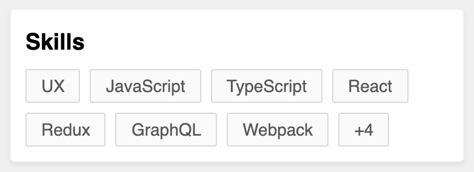

# react-truncate-list

Truncate a list of elements with a symbol or component of your choice

## Demo

A [demo](https://codesandbox.io/s/react-truncate-list-demo-okc5e) is worth a thousand words.

## Purpose

Have you ever needed to make something like the design below?



This is surprisingly hard to accomplish, as there is no way to know ahead of time how many items can fit within the space available. This is a low-level library to give you the tools necessary to make this a breeze.

## Installation

1. Add the `react-truncate-list` package

```bash
# npm
npm i react-truncate-list

# yarn
yarn add react-truncate-list
```

2. If your project does not already include it, add the `resize-observer-polyfill` package

```bash
# npm
npm i resize-observer-polyfill

# yarn
yarn add resize-observer-polyfill
```

3. Import the package and use it 🚀

```js
import TruncatedList from "react-truncate-list";
```

## How to use

This library simply provides an unstyled `<ul>` that will render a component of your choice after the last item that fits within it before overflowing. It is up to you to provide a `max-height` or some other constraint on its dimensions so that it will experience overflow behaviour.

Please see the [demo](https://codesandbox.io/s/react-truncate-list-demo-okc5e) for concrete examples for how the library can be used. As this is a low-level library, it takes a little more work than you may be used to. However this will be empower you to customise the list to look and behave exactly as you need.

## API

### Props

```ts
type RenderTruncator = ({
  hiddenItemsCount,
}: {
  hiddenItemsCount: number;
}) => React.ReactNode;

interface Props {
  renderTruncator: RenderTruncator;
  children?: React.ReactNode;
  alwaysShowTruncator?: boolean;
  className?: string;
  itemClassName?: string;
  style?: React.CSSProperties;
}
```

### `renderTruncator`

A render function called to display a 'truncator' after the last item before overflowing the container.

```jsx
renderTruncator={({ hiddenItemsCount }) => (
  <span>{hiddenItemsCount} more items...</span>
)}
```

### `children`

Pass the list items as children. Each child be wrapped in an `<li>`.

### `alwaysShowTruncator` (optional)

Always show the 'truncator', even when all items are visible. Useful for advanced use-cases such as an expanding list.
